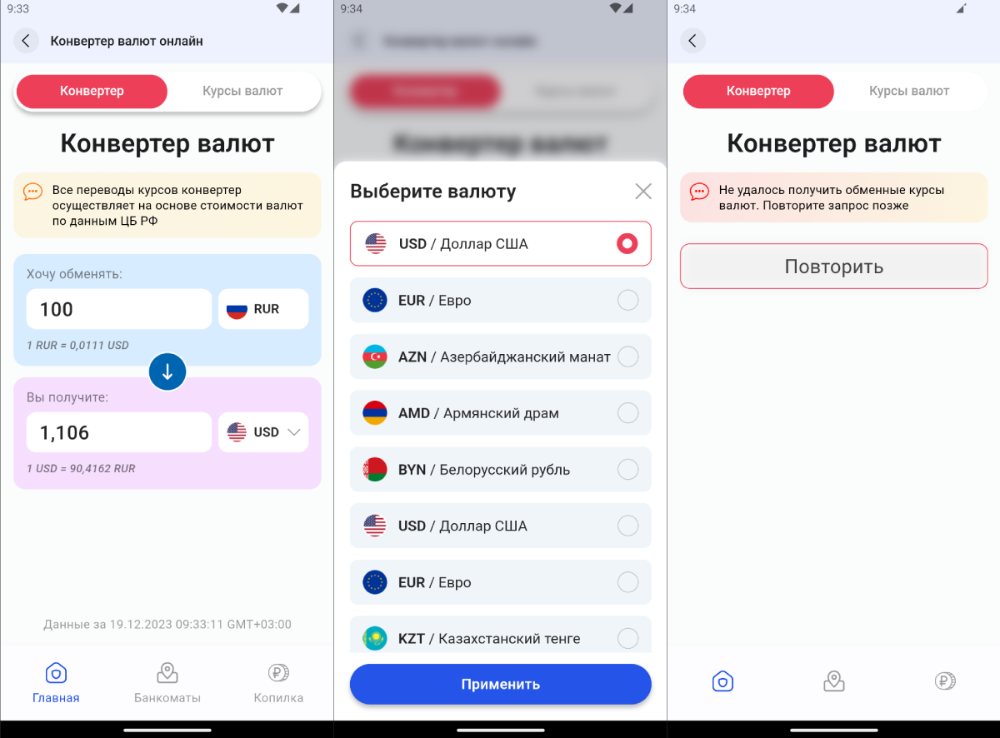

# Конвертер валют

## Задача
Реализовать экран конвертера валют из рублей в иностранную валюту

[Макет Figma](https://www.figma.com/file/NWA2I5vup0JydF8eW8qeiw/%D0%AD%D0%BA%D1%80%D0%B0%D0%BD---%D0%BA%D0%BE%D0%BD%D0%B2%D0%B5%D1%80%D1%82%D0%B5%D1%80)

API списка и обменного курса валют: https://рынок-валюты.рф/er/er.php

## Использованные инструменты
- Flutter
- ScreenUtil
- GoRouter
- BLoC (Cubit)
- Retrofit
- Internationalizing
- Подход Clean Architecture

## Скриншоты

